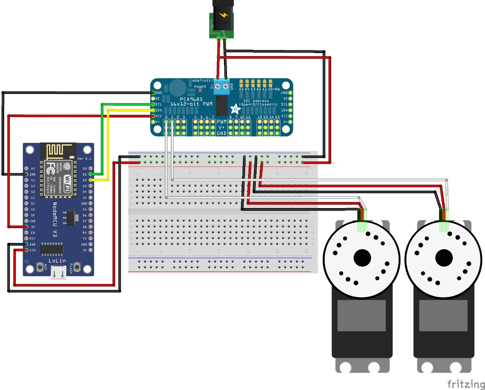

# robot-arm
Brazo Robot impreso en 3D desarrollado para PPS 2019 - Universidad CAECE

Proyecto basado en el siguiente artículo de [Instructables](https://www.instructables.com/id/3D-Printed-Robot-Arm/)

## Índice
- [robot-arm](#robot-arm)
  - [Índice](#%c3%8dndice)
  - [Armado](#armado)
    - [Lista de materiales](#lista-de-materiales)
    - [Guía de ensamble](#gu%c3%ada-de-ensamble)
  - [Preparación del Software](#preparaci%c3%b3n-del-software)
    - [Firmware](#firmware)
    - [Servidor Node.js](#servidor-nodejs)
  - [Controlar el Brazo](#controlar-el-brazo)
    - [Controlando el Brazo a través de la API](#controlando-el-brazo-a-trav%c3%a9s-de-la-api)
    - [Controlando el Brazo a través de la Aplicación Web](#controlando-el-brazo-a-trav%c3%a9s-de-la-aplicaci%c3%b3n-web)

## Armado

### Lista de materiales
 - 1x NodeMCU (Placa WiFi basada en Esp8266).
 - 1x PCA9685 (Controladora de Servos 16 Canales).
 - 1x Regulador de voltaje step down LM2596.
 - 1x Fuente de alimentación superior a 5V y 2A de corriente.
 - 3x Mini Servo Tower Pro Sg90.
 - 4x Servo S3003.
 - 1x Protoboard.
 - Cables conectores para protoboard.
 - Tornillos y tuercas M3 y M2 para fijar los servos.
 - [Partes impresas](modelos).

### Guía de ensamble
  - Ensamblar las piezas impresas tomando como referencia la guía de [Instructables](https://www.instructables.com/id/3D-Printed-Robot-Arm/)
  - Cablear la electronica siguiendo el siguiente diagrama:

***Nota 1:** que en el diagrama solo se dibujaron 2 de los 7 servos del brazo, conectar los restantes de manera similar, cada uno a un nuevo pin PWM de la placa PCA9685 y al canal de 5V y Tierra del protoboard.<br />**Nota 2:** Se recomiuenda al momento de cablear la electronica montar el NodeMCU en el protoboard. En el diagrama aparece separado a fines de simplificar la visualización de las conexiones.*

## Preparación del Software
Para controlar el brazo robot se utiliza el firmware [Firmata](https://github.com/firmata/arduino) en la placa NodeMCU y un servidor [Node.js](https://nodejs.org/en/) utilizando la librería de robótica [johnny-five](http://johnny-five.io/).

### Firmware
Para instalar el firmware Firmata en la placa NodeMCU seguir los siguientes pasos:
- Instalar las librerias de esp8266 para Arduino IDE siguiendo los pasos especificados en [Installing with Boards Manager](https://github.com/esp8266/Arduino#installing-with-boards-manager).
- Instalar las librerias de Firmata para Arduino IDE siguiendo los pasos especificados en [Updating Firmata in the Arduino IDE - Arduino 1.6.4 and higher](https://github.com/firmata/arduino#updating-firmata-in-the-arduino-ide---arduino-164-and-higher).
- Abrir un nuevo proyecto de StandardFirmataWifi desde ``` Archivo > Ejemplos > Firmata > StandardFirmataWifi  ```
- En el Archivo ```wifiConfig.h``` completar con los datos de la red wifi, IP del servidor Node.js y parámetros adicionales según sean necesario y guardar las modificaciones.

```
// Tipicamente los parametros a completar son:

char ssid[] = "your_network_name";
char wpa_passphrase[] = "your_wpa_passphrase";

#define SERVER_IP 10, 0, 0, 15 // La IP donde estará escuchando el servidor Node.js
#define SERVER_PORT 3030 // El puerto donde estará escuchando el servidor Node.js
```

- Seleccionar la placa NodeMCU en `Herramientas > Placa > NodeMCU 1.0 (ESP 12-E Module)`
- Conectar la placa NodeMCU por USB y quemar el firmware en la misma.

### Servidor Node.js
Para correr el servidor Node.js que controla el brazo clonarse este repositorio y seguir los siguientes pasos:
- Instalar [Node.js](https://nodejs.org/en/download/).
- Navegar a la carpeta raíz de este repositorio y executar `npm install`.
- Asegurarse de tener el brazo robot conectado a la red y apuntando a la IP de este servidor.
- Ejecutar `npm start`. Si todo está correctamente configurado el servidor se conectará al brazo e indicará que ya esta disponible para recibir ordenes.
- Por defecto el servidor se levanta en el puerto `8080` pero se lo puede cambiar asignando la variable de entorno `PORT`, por ejemplo: `PORT=3000 npm start`.


## Controlar el Brazo

### Controlando el Brazo a través de la API

Una vez levantado el servidor se pueden enviar comandos por HTTP de la siguiente manera:

```
curl -X POST \
  http://localhost:8080/move \
  -H 'Content-Type: application/json' \
  -H 'cache-control: no-cache' \
  -d '{
    "base": 0,
    "low": 45,
    "mid": 90,
    "up": 120,
    "rotate": 180,
    "claw": 30
}'
```

Los nombres de los servos son `base, low, mid, up, rotate y claw` y representan cada servo que tiene el brazo. En cada request HTTP a `/move` uno puede indicar todos los servos o tan solo los que desee, y darle un valor de `0` a `180` que representa el ángulo que va a tomar el servo indicado. Valores por fuera de este rango serán ignorados y no se tomará accion alguna.

### Controlando el Brazo a través de la Aplicación Web

Para facilitar el uso del Brazo robótico se desarrolló una simple aplicación web que interactua con el servidor Node.js. Para levantarla realizar los siguientes pasos:
- Navegar a la carpeta `./controller-app` de este repositorio y executar `npm install`.
- Ejecutar `npm start`. Se abrirá un navegador con la aplicación web.
